```plantuml
@startuml Giant-T_StageRider_1.0
skinparam handwritten true
skinparam Nodesep 50

top to bottom direction

package "Rig Robert" {
    node "Board" as RRB {
        node "G Lab GSC-3 System Controller" as RRBGSC3 {
            () "IN (TS)" as RRBGSC3I
            () "TUNER (TS)" as RRBGSC3T
            () "OUT (TS)" as RRBGSC3O
            () "OUT SW1&2 (TRS)" as RRBGSC3OS12
            () "OUT SW3&4 (TRS)" as RRBGSC3OS34
            () "WAH-PAD (TS)" as RRBGSC3WP
            () "MIDI OUT" as RRBGSC3MO
            rectangle "LOOP1" as RRBGSC3L1 {
                () "SEND (TS)" as RRBGSC3L1S
                () "RETURN (TS)" as RRBGSC3L1R
            }
            rectangle "LOOP2" as RRBGSC3L2 {
                () "SEND (TS)" as RRBGSC3L2S
                () "RETURN (TS)" as RRBGSC3L2R
            }
            rectangle "LOOP3" as RRBGSC3L3 {
                () "SEND (TS)" as RRBGSC3L3S
                () "RETURN (TS)" as RRBGSC3L3R
            }
            rectangle "LOOP4" as RRBGSC3L4 {
                () "SEND (TS)" as RRBGSC3L4S
                () "RETURN (TS)" as RRBGSC3L4R
            }
            rectangle "LOOP5" as RRBGSC3L5 {
                () "SEND (TS)" as RRBGSC3L5S
                () "RETURN (TS)" as RRBGSC3L5R
            }
            rectangle "LOOP6" as RRBGSC3L6 {
                () "SEND (TS)" as RRBGSC3L6S
                () "RETURN (TS)" as RRBGSC3L6R
            }
        }

        node "Lehle Little Dual" as RRBLLD {
            () "INPUT A/B (TS)" as RRBLLDAB
            () "OUTPUT A (TS)" as RRBLLDA
            () "OUTPUT B (TS)" as RRBLLDB
        }

        node "Whammy-Pad WP-2" as RRBWP2 {
            node "Morley Power Wah Boost" as RRBPWB {
                () "IN (TS)" as RRBPWBI
                () "OUT (TS)" as RRBPWBO
            }
            () "OUT (TS)" as RRBWP2O
        }

        ' rectangle "Electro Harmonix Pitchfork" as RRBEHP {
        '     () "IN" as RRBEHPI
        '     () "OUT" as RRBEHPO
        ' }

        node "Electro Harmonix POG2" as RRBEHPOG2 {
            () "IN (TS)" as RRBEHPOG2I
            () "OUT (TS)" as RRBEHPOG2O
        }
    }
    node "Rack" as RRR {
        node "Korg ToneWorks DTR-2" as RRRDTR2 {
            () "INPUT (TS)" as RRRDTR2I
            () "OUTPUT (TS)" as RRRDTR2O
            () "FOOTSWITCH (TS)" as RRRDTR2FS
        }

        ' rectangle "Ampeg SVT-IIP" as RRRSVTIIP {
        '     rectangle "INPUTS" as RRRSVTIIPI {
        '         () "NORMAL" as RRRSVTIIPIN
        '         () "BRIGHT" as RRRSVTIIPIB
        '     }
        '     rectangle "OUTPUTS" as RRRSVTIIPO {
        '         () "BAL. OUT" as RRRSVTIIPOBO
        '         () "MAIN OUT 1" as RRRSVTIIPOMO1
        '         () "MAIN OUT 2" as RRRSVTIIPOMO2
        '     }
        '     () "FOOTSWITCH" as RRRSVTIIPFS
        ' }

        node "Ampeg SVP-PRO" as RRRSVPPRO {
            () "INPUT (TS)" as RRRSVPPROI
            rectangle "PREAMP OUT" as RRRSVPPROPO {
                () "OUT 1 (TS)" as RRRSVPPROPO1
                () "OUT 2 (TS)" as RRRSVPPROPO2
            }
            rectangle "EFFECTS" as RRRSVPPROE {
                () "RETURN (TS)" as RRRSVPPROER
                () "SEND (TS)" as RRRSVPPROES
            }
            () "FOOTSWITCH (TRS)" as RRRSVPPROFS
            () "TUNER OUT (TS)" as RRRSVPPROTO
            () "TRANSFORMER BAL. OUT (XLR)" as RRRSVPPROBO
        }

        node "Ampeg SVP-BSP" as RRRSVPBSP {
            rectangle "PREAMP OUTPUTS" as RRRSVPBSPPO {
                () "OVERDRIVE (TS)" as RRRSVPBSPPOO
                () "CLEAN/MIX (TS)" as RRRSVPBSPPCM
            }
            rectangle "EFFECTS LOOP" as RRRSVPBSPEL {
                rectangle "OVERDRIVE" as RRRSVPBSPELO {
                    () "SEND (TS)" as RRRSVPBSPELOS
                    () "RETURN (TS)" as RRRSVPBSPELOR
                }
                rectangle "CLEAN" as RRRSVPBSPELC {
                    () "SEND (TS)" as RRRSVPBSPELCS
                    () "RETURN (TS)" as RRRSVPBSPELCR
                }
            }
            rectangle "TRANSFORMER BAL. OUTPUT" as RRRSVPBSPTBO {
                () "OVERDRIVE (XLR)" as RRRSVPBSPTBOO
                () "CLEAN (XLR)" as RRRSVPBSPTBOC
            }
            () "INPUT (TS)" as RRRSVPBSPI
            () "FOOTSWITCH (TRS)" as RRRSVPBSPFS
            () "TUNER OUT (TS)" as RRRSVPBSPTO
        }

        node "Lexicon MPX1" as RRRMPX1 {
            rectangle "MIDI" as RRRMPX1M {
                () "IN" as RRRMPX1MI
                () "THRU" as RRRMPX1MT
                () "OUT" as RRRMPX1MO
            }
            rectangle "INPUTS" as RRRMPX1I{
                () "LEFT (TRS)" as RRRMPX1ILT
                () "LEFT (XLR)" as RRRMPX1ILX
                () "RIGHT (TRS)" as RRRMPX1IRT
                () "RIGHT (XLR)" as RRRMPX1IRX
            }
            rectangle "OUTPUTS" as RRRMPX1O {
                () "LEFT (TRS)" as RRRMPX1OLT
                () "LEFT (XLR)" as RRRMPX1OLX
                () "RIGHT (TRS)" as RRRMPX1ORT
                () "RIGHT (XLR)" as RRRMPX1ORX                
            }
            () "FOOTPEDAL" as RRRMPX1FP
            () "FOOTSWITCH (TRS)" as RRRMPX1FS

            RRRMPX1I -[hidden]r-> RRRMPX1O
            RRRMPX1O -[hidden]r-> RRRMPX1M
        }

        node "Ashly CLX-52" as RRRCLX52 {
            rectangle "CHANNEL 1" as RRRCLX52C1 {
                () "INPUT (TRS)" as RRRCLX52C1IT
                () "INPUT (XLR)" as RRRCLX52C1IX
                () "OUTPUT (TRS)" as RRRCLX52C1OT
                () "OUTPUT (XLR)" as RRRCLX52C1OX
            }
            rectangle "CHANNEL 2" as RRRCLX52C2 {
                () "INPUT (TRS)" as RRRCLX52C2IT
                () "INPUT (XLR)" as RRRCLX52C2IX
                () "OUTPUT (TRS)" as RRRCLX52C2OT
                () "OUTPUT (XLR)" as RRRCLX52C2OX
            }

            RRRCLX52C1 -[hidden]r-> RRRCLX52C2
        }

        ' rectangle "Palmer PAN 03 Passive" as RRRPAN03 {
        '     rectangle "CHANNEL A" as RRRPAN03CA {
        '         () "INPUT" as RRRPAN03CAI
        '         () "LINK" as RRRPAN03CAL
        '         () "OUTPUT" as RRRPAN03CAO
        '     }
        '     rectangle "CHANNEL B" as RRRPAN03CB {
        '         () "INPUT" as RRRPAN03CBI
        '         () "LINK" as RRRPAN03CBL
        '         () "OUTPUT" as RRRPAN03CBO
        '     }
        '     rectangle "CHANNEL C" as RRRPAN03CC {
        '         () "INPUT" as RRRPAN03CCI
        '         () "LINK" as RRRPAN03CCL
        '         () "OUTPUT" as RRRPAN03CCO
        '     }
        '     rectangle "CHANNEL D" as RRRPAN03CD {
        '         () "INPUT" as RRRPAN03CDI
        '         () "LINK" as RRRPAN03CDL
        '         () "OUTPUT" as RRRPAN03CDO
        '     }
        '     () "Test" as test
        ' }

        node "Red Rock Modus M 4.5 LINEAR ONE" as RRRRRM1 {
            () "INPUT A (XLR)" as RRRRRM1IA
            () "INPUT B (XLR)" as RRRRRM1IB
            () "OUTPUT A (SPEAKON)" as RRRRRM1OA
            () "OUTPUT B (SPEAKON)" as RRRRRM1OB
        }

        node "Red Rock Modus M 4.5 LINEAR TWO" as RRRRRM2 {
            () "INPUT A (XLR)" as RRRRRM2IA
            () "INPUT B (XLR)" as RRRRRM2IB
            () "OUTPUT A (SPEAKON)" as RRRRRM2OA
            () "OUTPUT B (SPEAKON)" as RRRRRM2OB
        }
    ' Ordering the rack...
    RRRDTR2 -[hidden]d-> RRRSVPBSP
    RRRSVPBSP -[hidden]d-> RRRCLX52
    RRRCLX52 -[hidden]d-> RRRSVPPRO
    RRRSVPPRO -[hidden]d-> RRRMPX1
    RRRMPX1 -[hidden]d-> RRRRRM2
    RRRRRM2 -[hidden]d-> RRRRRM1
    }

    actor Robert as ROBERT
    node "Bass" as BASS

    rectangle "SPEAKERS LEFT" as SL {
        node "Marshall MBC 410 HIGH" as MBC410_1 {
            () "INPUT (SPEAKON)" as MBC410_1I
        }
        node "Marshall MBC 410 LOW" as MBC410_2 {
            () "INPUT (SPEAKON)" as MBC410_2I
        }
    }

    rectangle "SPEAKERS RIGHT" as SR {
        node "Marshall MBC 410 HIGH" as MBC410_3 {
            () "INPUT (SPEAKON)" as MBC410_3I
        }
        node "Marshall MBC 410 LOW" as MBC410_4 {
            () "INPUT (SPEAKON)" as MBC410_4I
        }
    }

    ROBERT -> BASS
    BASS --> RRBLLDAB
    RRBLLDB --> RRBGSC3I
    RRBLLDA ----> RRRSVPPROI    
    RRBWP2O --> RRBGSC3WP
    RRBPWBI --> RRBGSC3L2S
    RRBPWBO --> RRBGSC3L2R
    RRBEHPOG2I --> RRBGSC3L1S
    RRBEHPOG2O --> RRBGSC3L1R
    RRBGSC3O ----> RRRSVPBSPI
    RRBGSC3MO ----> RRRMPX1MT
    RRBGSC3OS12 ----> RRRSVPBSPFS
    RRBGSC3OS34 ----> RRRSVPPROFS
    
    ' Ordering the board
    RRBWP2 -[hidden]r-> RRBEHPOG2
    RRBEHPOG2 -[hidden]r-> RRBLLD
    RRBEHPOG2 -[hidden]d-> RRBGSC3
    
    RRRSVPBSPTO -up-> RRRDTR2I
    RRRSVPPROES -down-> RRRCLX52C2IT
    RRRCLX52C2OT -down-> RRRSVPPROER
    RRRSVPBSPELCS -up-> RRRCLX52C1IT
    RRRCLX52C1OT -up-> RRRSVPBSPELCR
    RRRSVPPROBO -down-> RRRRRM1IA
    RRRSVPBSPTBOC -down-> RRRMPX1ILX
    RRRMPX1OLX -down-> RRRRRM2IA
    RRRMPX1ORX -down-> RRRRRM2IB
    RRRRRM1OA ----> MBC410_2I
    RRRRRM1OB ----> MBC410_4I
    RRRRRM2OA ----> MBC410_1I
    RRRRRM2OB ----> MBC410_3I
}

remove @unlinked
@enduml
```

- 👋 Hi, I’m @BoBoBaSs84
- 👀 I’m interested in music, playing bass and so ...
- 🌱 I’m currently learning well a lot, sql, C#, xml, xsd, .net, asp, blazor ...
- 💞️ I’m looking to collaborate on ...
- 📫 How to reach me ...

<!---
BoBoBaSs84/BoBoBaSs84 is a ✨ special ✨ repository because its `README.md` (this file) appears on your GitHub profile.
You can click the Preview link to take a look at your changes.
--->

## 🧰 Languages and Tools:

## 🏆 My Github Stats:

 

## 🎵 Music ... well i'm gettin' kinda old ... so thx to plantUML! what did i just did with my RIG?!?!

